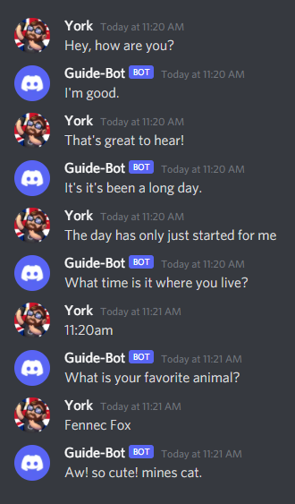

# Cleverbot Integration


Cleverbot **NO LONGER** offers a free trial; this guide page will **NOT** be updated to use any other module.


I've had this request since I started An Idiot's Guide, in fact it was one of the very first requests I had, but I had a feeling it would be a disappointing short episode, maybe a 5 minute long episode. But for a written guide it'd be perfect!

So to get started, let's grab the example from [getting started](../getting-started/getting-started-long-version.md) and shove it in a file.

```javascript
const { Client, Intents } = require("discord.js");
const client = new Client({
  intents: [Intents.FLAGS.GUILDS, Intents.FLAGS.GUILD_MESSAGES]
});

client.on("ready", () => {
  console.log("I am ready!");
});

client.on("messageCreate", (message) => {
  if (message.content.startsWith("ping")) {
    message.channel.send("pong!");
  }
});

client.login("SuperSecretBotTokenHere");
```

Once you've got that, we should go check out `cleverbot-node` on [npmjs.com](https://www.npmjs.com/package/cleverbot-node) and grab their example code

```javascript
var Cleverbot = require("cleverbot-node");
cleverbot = new Cleverbot;
cleverbot.configure({ botapi: "IAMKEY" });
cleverbot.write(cleverMessage, function (response) {
   console.log(response.output);
});
```

Alright, we've got both parts we need, now before we continue we should get the module installed, just run `npm i cleverbot-node`.

Installed? Good! Now, let's get to the final step... the code.

We have both our example codes, now we need to combine them for a working bot.

> **NOTE:** A lot of the naive developers would just shove the cleverbot example straight in their message event and wonder why it wasn't working. It would create a new instance of Cleverbot and would eventually cause a memory leak.

Right, we need to take the first two lines of the cleverbot example...

```javascript
var Cleverbot = require("cleverbot-node");
cleverbot = new Cleverbot;
```

...and put them with our discord definitions.

```javascript
const { Client, Intents } = require("discord.js");
const Cleverbot = require("cleverbot-node");
const client = new Client({
  intents: [Intents.FLAGS.GUILDS, Intents.FLAGS.GUILD_MESSAGES]
});
const clbot = new Cleverbot;
clbot.configure({ botapi: "IAMKEY" });
```

I renamed `cleverbot` to `clbot` to reduce any possible confusion between the variable names as JavaScript is case sensitive.

Then we take the rest of the code and place that inside our message event handler, but for this example I only want the bot to talk to me in DM's, so we'll check the channel `type` with the following code, you can make it respond on mentions or even in channels \(I would honestly advise against that.\) but we also need to add the `DIRECT_MESSAGES` intent and the `CHANNEL` partial as DM channels can be uncached.

Checking the channel type.

```javascript
if (message.channel.type === "DM") {
  // Cleverbot code goes here.
}
```

Don't forget to add these within your client object.

```javascript
[Intents.FLAGS.DIRECT_MESSAGES],
partials: ["CHANNEL"]
```

Your code should look something like this...

```javascript
const { Client, Intents } = require("discord.js");
const Cleverbot = require("cleverbot-node");
const client = new Client({
  intents: [Intents.FLAGS.GUILDS, Intents.FLAGS.GUILD_MESSAGES, Intents.FLAGS.DIRECT_MESSAGES],
  partials: ["CHANNEL"]
});
const clbot = new Cleverbot;
clbot.configure({ botapi: "IAMKEY" });

client.on("messageCreate", message => {
  if (message.channel.type === "DM") {
    clbot.write(message.content, (response) => {
      message.channel.sendTyping();
      setTimeout(() => {
        message.channel.send(response.output).catch(console.error);
      }, Math.random() * (1 - 3) + 1 * 1000);
    });
  }
});
 
client.on("ready", () => {
  console.log("I am ready!");
});
 
client.login("superSecretBotTokenHere");
```

If everything is as above, then just send your bot a DM and watch the magic unfold!


