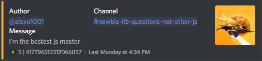

# Making a Starboard

This is a long awaited feature, requested by many people.

Let's begin by talking about what a starboard is. This is an example taken from the Discord.js Official Server.



A starboard is a popular feature in bots that serve as a channel of messages that users of the server find funny, stupid, or both! To make a functioning starboard, we need to monitor for a reaction being added to a message, and we'll do this with the `messageReactionAdd` and `messageReactionRemove` events.


Before we start, there is one thing you need to know. This tutorial is only immediately compatible with Guidebot Class. Unless you're using it, you'll need to modify the code to your needs!


So, let's begin!

In this block, we just do some simple setup for later on. For ease, I personally define the message object as `message`, but this is completely optional. Next, we grab the starboardChannel key from the guilds settings.


Reminder: GuideBot and GuideBot-Class use [Enmap ](https://www.npmjs.com/package/enmap)for settings!


Then, we preform a couple of checks on the reaction and the message. First, we check if the reaction is **NOT** the unicode star emote. Next, we preform two checks on the message, checking to see if the user who added the reaction authored the message, if the user who sent the message is the person who reacted to it, and if the message author is a bot. If none of these checks return true, we're good to move on.


Now, it's very important that you have a starboardChannel key in your servers settings before you attempt to use this. If you're using Guidebot, you can simply run `conf add starboardChannel starboard` and apply the change to all guilds!


```javascript
module.exports = class {
  constructor(client) {
    this.client = client;
  }

  // This is where all the action happens. 
  async run(reaction, user) {
    const message = reaction.message;
     // This is the first check where we check to see if the reaction is not the unicode star emote.
    if (reaction.emoji.name !== '⭐') return;
     // Here we check to see if the person who reacted is the person who sent the original message.
    if (message.author.id === user.id) return message.channel.send(`${user}, you cannot star your own messages.`);
    // This is our final check, checking to see if message was sent by a bot.
    if (message.author.bot) return message.channel.send(`${user}, you cannot star bot messages.`);
    // Here we get the starboard channel from the guilds settings. 
    const { starboardChannel } = this.client.settings.get(message.guild.id); 
    // Here we will find the channel
    const starChannel = message.guild.channels.find(channel => channel.name == starboardChannel)
    // If there's no starboard channel, we stop the event from running any further, and tell them that they don't have a starboard channel.
    if (!starChannel) return message.channel.send(`It appears that you do not have a \`${starboardChannel}\` channel.`); 
  }
}
```

Now, this next block may look real complex, but it really isn't. Let's break it down.

First, we declare 6 variables here, fetch, stars, star, foundStar, image, and embed. `fetch` will fetch the last 100 messages in the starboard channel, `stars` attempts to find an embed who's footer ends with the message's id.

Next, we'll start an if statement for if there is already an embed in the starboard channel for this message, and we also define our final 4 variables. `star` is a simple regex to check how many stars the embed already has, `foundStar` allows us to use the color of the pre-existing embed, `image` checks if there is anything attached to the message, and `embed` is our new embed!

We also use a function that hasn't been talked about yet, and that is `this.extension`. It checks the message to see if it has any images. You'll see that later, as it's not _too_ important.

I told you it wasn't that complicated. Let's keep going.

```javascript
// Here we fetch 100 messages from the starboard channel.
const fetch = await starChannel.fetchMessages({ limit: 100 }); 
// We check the messages within the fetch object to see if the message that was reacted to is already a message in the starboard,
const stars = fetch.find(m => m.embeds[0].footer.text.startsWith('⭐') && m.embeds[0].footer.text.endsWith(message.id)); 
// Now we setup an if statement for if the message is found within the starboard.
if (stars) {
  // Regex to check how many stars the embed has.
  const star = /^\⭐\s([0-9]{1,3})\s\|\s([0-9]{17,20})/.exec(stars.embeds[0].footer.text);
  // A variable that allows us to use the color of the pre-existing embed.
  const foundStar = stars.embeds[0];
  // We use the this.extension function to see if there is anything attached to the message.
  const image = message.attachments.size > 0 ? await this.extension(reaction, message.attachments.array()[0].url) : ''; 
  const embed = new RichEmbed()
    .setColor(foundStar.color)
    .setDescription(foundStar.description)
    .setAuthor(message.author.tag, message.author.displayAvatarURL)
    .setTimestamp()
    .setFooter(`⭐ ${parseInt(star[1])+1} | ${message.id}`)
    .setImage(image);
  // We fetch the ID of the message already on the starboard.
  const starMsg = await starChannel.fetchMessage(stars.id);
  // And now we edit the message with the new embed!
  await starMsg.edit({ embed }); 
}
```

Now, if you were to just use the code above, your starboard would only function if there was already a message in the starboard channel. Let's take care of that.

Here we add an if statement that mimics and is placed after the previous block, but this time manually setting the color of the embed, and also manually setting the amount of stars the embed will have.

```javascript
// Now we use an if statement for if a message isn't found in the starboard for the message.
if (!stars) {
  // We use the this.extension function to see if there is anything attached to the message.
  const image = message.attachments.size > 0 ? await this.extension(reaction, message.attachments.array()[0].url) : ''; 
  // If the message is empty, we don't allow the user to star the message.
  if (image === '' && message.cleanContent.length < 1) return message.channel.send(`${user}, you cannot star an empty message.`); 
  const embed = new RichEmbed()
    // We set the color to a nice yellow here.
    .setColor(15844367)
    // Here we use cleanContent, which replaces all mentions in the message with their
    // equivalent text. For example, an @everyone ping will just display as @everyone, without tagging you!
    // At the date of this edit (09/06/18) embeds do not mention yet.
    // But nothing is stopping Discord from enabling mentions from embeds in a future update.
    .setDescription(message.cleanContent) 
    .setAuthor(message.author.tag, message.author.displayAvatarURL)
    .setTimestamp(new Date())
    .setFooter(`⭐ 1 | ${message.id}`)
    .setImage(image);
  await starChannel.send({ embed });
}
```

Now, if you've been following along exactly, you have a working starboard! But if you like a TL;DR, here ya go.

```javascript
module.exports = class {
  constructor(client) {
    this.client = client;
  }

  async run(reaction, user) {
    const message = reaction.message;
    if (reaction.emoji.name !== '⭐') return;
    if (message.author.id === user.id) return message.channel.send(`${user}, you cannot star your own messages.`);
    if (message.author.bot) return message.channel.send(`${user}, you cannot star bot messages.`);
    const { starboardChannel } = this.client.settings.get(message.guild.id);
    const starChannel = message.guild.channels.find(channel => channel.name === starboardChannel)
    if (!starChannel) return message.channel.send(`It appears that you do not have a \`${starboardChannel}\` channel.`); 
    const fetchedMessages = await starChannel.fetchMessages({ limit: 100 });
    const stars = fetchedMessages.find(m => m.embeds[0].footer.text.startsWith('⭐') && m.embeds[0].footer.text.endsWith(message.id));
    if (stars) {
      const star = /^\⭐\s([0-9]{1,3})\s\|\s([0-9]{17,20})/.exec(stars.embeds[0].footer.text);
      const foundStar = stars.embeds[0];
      const image = message.attachments.size > 0 ? await this.extension(reaction, message.attachments.array()[0].url) : '';
      const embed = new RichEmbed()
        .setColor(foundStar.color)
        .setDescription(foundStar.description)
        .setAuthor(message.author.tag, message.author.displayAvatarURL)
        .setTimestamp()
        .setFooter(`⭐ ${parseInt(star[1])+1} | ${message.id}`)
        .setImage(image);
      const starMsg = await starChannel.fetchMessage(stars.id);
      await starMsg.edit({ embed });
    }
    if (!stars) {
      const image = message.attachments.size > 0 ? await this.extension(reaction, message.attachments.array()[0].url) : '';
      if (image === '' && message.cleanContent.length < 1) return message.channel.send(`${user}, you cannot star an empty message.`);
      const embed = new RichEmbed()
        .setColor(15844367)
        .setDescription(message.cleanContent)
        .setAuthor(message.author.tag, message.author.displayAvatarURL)
        .setTimestamp(new Date())
        .setFooter(`⭐ 1 | ${message.id}`)
        .setImage(image);
      await starChannel.send({ embed });
    }
  }

  // Here we add the this.extension function to check if there's anything attached to the message.
  extension(reaction, attachment) {
    const imageLink = attachment.split('.');
    const typeOfImage = imageLink[imageLink.length - 1];
    const image = /(jpg|jpeg|png|gif)/gi.test(typeOfImage);
    if (!image) return '';
    return attachment;
  }
};
```

So, all that code up there is only for if a reaction is added. Now, we'll handle if a reaction is removed.

Here, we very closely mimic the messageReactionAdd event, only this time we'll **subtract** 1 from the total amount of stars that are on the embed.'

There's only a slight difference between the `messageReactionAdd` and the `messageReactionRemove` event, and that is the `messageReactionAdd` event fires when a reaction is added, and the `messageReactionRemove` event fires when a reaction is removed.

```javascript
// Here we need to check if the user who removed the reaction is not the message author, as the star would then only remove one star as we did return when he added it
if (message.author.id === user.id) return;
if (stars) {
  const star = /^\⭐\s([0-9]{1,3})\s\|\s([0-9]{17,20})/.exec(stars.embeds[0].footer.text);
  const foundStar = stars.embeds[0];
  const image = message.attachments.size > 0 ? await this.extension(reaction, message.attachments.array()[0].url) : '';
  const embed = new RichEmbed()
    .setColor(foundStar.color)
    .setDescription(foundStar.description)
    .setAuthor(message.author.tag, message.author.displayAvatarURL)
    .setTimestamp()
    .setFooter(`⭐ ${parseInt(star[1])-1} | ${message.id}`)
    .setImage(image);
  const starMsg = await starChannel.fetchMessage(stars.id);
  await starMsg.edit({ embed });
  // Here we want to check if the message now has 0 Stars
  if(parseInt(star[1]) - 1 == 0) return starMsg.delete(1000);
}
```

Here's the finalized code block for the `messageReactionRemove` event.

```javascript
module.exports = class {
  constructor(client) {
    this.client = client;
  }

  async run(reaction, user) {
    const message = reaction.message;
    if (message.author.id === user.id) return;
    if (reaction.emoji.name !== '⭐') return;
    const { starboardChannel } = this.client.settings.get(message.guild.id);
    const starChannel = message.guild.channels.find(channel => channel.name == starboardChannel)
    if (!starChannel) return message.channel.send(`It appears that you do not have a \`${starboardChannel}\` channel.`); 
    const fetchedMessages = await starChannel.fetchMessages({ limit: 100 });
    const stars = fetchedMessages.find(m => m.embeds[0].footer.text.startsWith('⭐') && m.embeds[0].footer.text.endsWith(reaction.message.id));
    if (stars) {
      const star = /^\⭐\s([0-9]{1,3})\s\|\s([0-9]{17,20})/.exec(stars.embeds[0].footer.text);
      const foundStar = stars.embeds[0];
      const image = message.attachments.size > 0 ? await this.extension(reaction, message.attachments.array()[0].url) : '';
      const embed = new RichEmbed()
        .setColor(foundStar.color)
        .setDescription(foundStar.description)
        .setAuthor(message.author.tag, message.author.displayAvatarURL)
        .setTimestamp()
        .setFooter(`⭐ ${parseInt(star[1])-1} | ${message.id}`)
        .setImage(image);
      const starMsg = await starChannel.fetchMessage(stars.id);
      await starMsg.edit({ embed });
      if(parseInt(star[1]) - 1 == 0) return starMsg.delete(1000);
    }
  }

  // Now, it may seem weird that we use this in the messageReactionRemove event, but we still need to check if there's an image so that we can set it, if necessary.
  extension(reaction, attachment) {
    const imageLink = attachment.split('.');
    const typeOfImage = imageLink[imageLink.length - 1];
    const image = /(jpg|jpeg|png|gif)/gi.test(typeOfImage);
    if (!image) return '';
    return attachment;
  };
};
```

