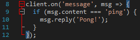

# Common Errors

## Cannot find module `discord.js`

### Problem:

You didn't install Discord.js or installed it in the wrong folder.

### Solution:

* Make sure you are in the **correct** folder where you have your bot's files
* SHIFT+Right-Click in the folder and select **Open command window here**
* Run `npm init -y`, and hit enter until the wizard is complete
* Run `npm i discord.js` again to install Discord.

## `Error: getaddrinfo ENOTFOUND gateway.discord.gg gateway.discord.gg:443`

### Problem:

Your internet went down.

### Solution:

Get better, more stable internet, or host your bot on a VPS.

## Unexpected End of Input

### Problem:

```text
});
^
SyntaxError: Unexpected end of input
```

### Solution:

Your code has an error somewhere. This is _impossible_ to troubleshoot without the **complete** code, since the error can be anywhere \(in fact the error stack often tells you it's at the end of your code\).

The following trick is a lifesaver, so pay attention: Your code editor is trying to help you. Whatever editor you're using \(except notepad++.exe. Don't use notepad++!\), clicking on any \(and I mean any\) special character such as parentheses, square brackets, curly braces, double and single quotes, will automatically highlight the one that matches it. The screenshot below shows this: I clicked on the curly brace at the bottom, it shows me the one on top by highlighting it. Learn this, and how different functions and event handlers "look" like.



You can check out [Installing and Using a Proper Editor](other-guides/installing-and-using-a-proper-editor.md) to help in at least knowing there are errors _before_ running your bot code.

