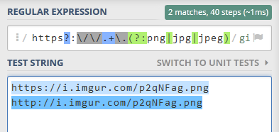
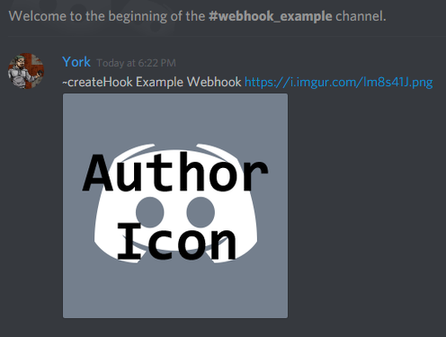
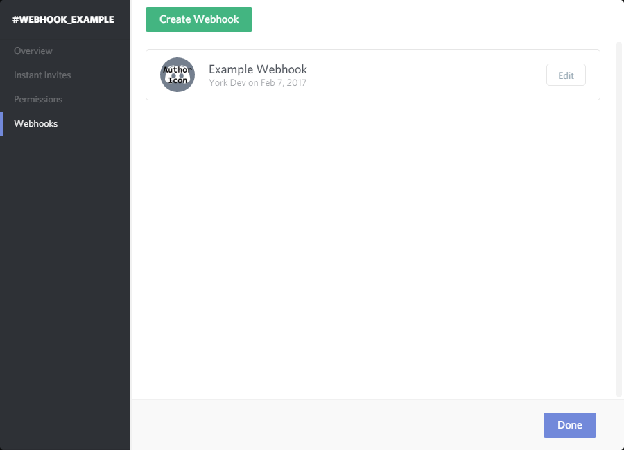

# Webhooks \(Part 1\)


At the time of writing this guide \(07/02/2017\) there is a bug with how webhooks are created via code, you must supply a webhook name and avatar. **However it does not work as intended.** You must _edit_ the webhook with the same details for the avatar to be applied.


This has been a rather demanded topic recently, everyone wants to know how to use the webhooks, so here I am with this guide to explain the basic coverage of the webhooks.

As per usual let's grab the example source code.

```javascript
const Discord = require("discord.js");
const client = new Discord.Client();

client.on("ready", () => {
  console.log("I am ready!");
});

client.on("message", (message) => {
  if (message.content.startsWith("ping")) {
    message.channel.send("pong!");
  }
});

client.login("SuperSecretBotTokenHere");
```

Right, we'll start off slow, we need to create a webhook first, if we look at the [documentation](https://discord.js.org/#/docs/main/stable/class/TextChannel?scrollTo=createWebhook) it comes with an example, that is basically all we need to create a webhook, but we'll add some polish to it and throw it into a basic command.

```javascript
// This will create the webhook with the name "Example Webhook" and an example avatar.
message.channel.createWebhook("Example Webhook", "https://i.imgur.com/p2qNFag.png")
// This will actually set the webhooks avatar, as mentioned at the start of the guide.
.then(webhook => webhook.edit("Example Webhook", "https://i.imgur.com/p2qNFag.png")
// This will get the bot to DM you the webhook, if you use this in a selfbot,
// change it to a console.log as you cannot DM yourself
.then(wb => message.author.send(`Here is your webhook https://canary.discordapp.com/api/webhooks/${wb.id}/${wb.token}`)).catch(console.error))
```

This is what it should look like if you test the code.



This webhook link has long since been deleted.


Now, that's all well and good, we can create the webhooks and get our bot to DM us, but the values are _hardcoded_, which means if we run that command, we'd get webhooks by the same name / avatar all the time, let's fix that shall we? we'll be looking at the [command arguments](../first-bot/command-with-arguments.md) page.

You should have a message handler that looks something like this.

```javascript
let prefix = "~";
client.on("message", message => {
  let args = message.content.split(" ").slice(1);
  if (message.content.startsWith(prefix + "createHook")) {
    message.channel.createWebhook("Example Webhook", "https://i.imgur.com/p2qNFag.png")
      .then(webhook => webhook.edit("Example Webhook", "https://i.imgur.com/p2qNFag.png")
        .then(wb => message.author.send(`Here is your webhook https://canary.discordapp.com/api/webhooks/${wb.id}/${wb.token}`))
        .catch(console.error))
      .catch(console.error);
  }
});
```

So far so good, but we're going to run into a problem, what if you want to give your webhook a name that contains spaces? Right now you'd end up with the avatar url in the name, so we're going to have to use some _regex_, [Regular Expressions](https://developer.mozilla.org/en/docs/Web/JavaScript/Guide/Regular_Expressions) is very powerful, and very daunting to start out with, but don't worry, the regex I'm going to supply for this example works, just drop it in your code and you're good.

Here's the regex on it's own

```javascript
/https?:\/\/.+\.(?:png|jpg|jpeg)/gi
```

Using the above regex with `match`, `replace` and `test` will allow you to isolate the image url in the string and leave the remaining string to be used as the webhook's name, there's an amazing online tool called [regex101.com](https://regex101.com/), with that tool I was able to create the above regex, here's an image of it in action.



I'm not going to go into much detail, but the fact that both of the test strings are highlighted, and it's saying there's 2 matches is all we need to know, it works with links starting with `http` and `https`, and it looks for valid extensions, which are jpg, jpeg and png.

let's do the rest of the command shall we? we've got our regex, and we know we need to use `match`, `replace` and `test`, so we should `test` for a link first using our regex, if it returns false we need to notify the user, if it returns true we need to `match` and `replace` for the rest, the code can look like this.

```javascript
const nameAvatar = args.join(" ");
const linkCheck = /https?:\/\/.+\.(?:png|jpg|jpeg)/gi;
if (!linkCheck.test(nameAvatar)) return message.reply("You must supply an image link.");
const avatar = nameAvatar.match(linkCheck)[0];
const name = nameAvatar.replace(linkCheck, "");
message.channel.createWebhook(name, avatar)
  .then(webhook => webhook.edit(name, avatar)
    .catch(error => console.log(error)))
  .then(wb => message.author.send(`Here is your webhook https://canary.discordapp.com/api/webhooks/${wb.id}/${wb.token}\n\nPlease keep this safe, as you could be exploited.`)
    .catch(error => console.log(error)))
  .catch(error => console.log(error));
```

Alright, now let's throw that together with our bot code and issue the command!



And let's check the channel webhooks!



Wooo! we did it!

Now we can create webhooks on the fly via our bot code, but in the next [_chapter_](discord-webhooks-part-2.md) we'll see what we can do with them!

