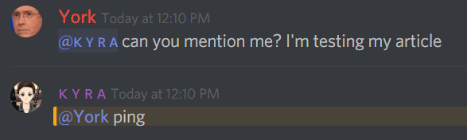
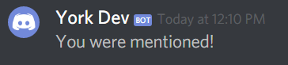

# Webhooks \(Part 2\)

In the [last chapter](discord-webhooks-part-1.md) we covered how to create the webhooks via code, which to be honest isn't very useful, in this chapter we will continue where we left off and we will actually use the webhooks we create in some bot code.

Now, one way we could use this, is to grab mentions... For some reason people think it's acceptable to mention me then shortly afterwards remove the mention if I don't respond within X seconds or minutes.

We have two choices, either create a stand-alone bot, or throw it in an existing bot... For the purposes of this guide I will throw the code in a stand alone bot, but it should be pretty self-explanatory how to add this to an existing bot.

Let's grab some example code...

```javascript
const Discord = require("discord.js");
const client = new Discord.Client();

client.on("ready", () => {
  console.log("I am ready!");
});

let prefix = "~";
client.on("message", (message) => {
  if (message.author.id === client.user.id || message.author.bot) return;
  let args = message.content.split(" ").slice(1);
  if (message.content.startsWith(prefix + "ping")) {
    message.channel.send("pong!");
  }
});

client.login("SuperSecretBotTokenHere");
```

Now, we've got the example code, we want to take our previously made webhook and grab the `id` and `token` from the URL, let's get it together!

You want to start off by defining your webhook at the top of your code, don't forget to replace `Webhook ID` and `Webhook Token` with their respective values.

```javascript
const Discord = require("discord.js");
const client = new Discord.Client();
const mentionHook = new Discord.WebhookClient("Webhook ID", "Webhook Token");

client.on("ready", () => {
  console.log("I am ready!");
});

let prefix = "~";
client.on("message", (message) => {
  if (message.author.id === client.user.id || message.author.bot) return;
  let args = message.content.split(" ").slice(1);
  if (message.content.startsWith(prefix + "ping")) {
    message.channel.send("pong!");
  }
});

client.login("SuperSecretBotTokenHere");
```

Now, this bit will be a little long winded; but inside the message event you want to check for mentions, now the more mentions you can capture the better, for example there's the `@everyone` and `@here` mentions, role mentions and the direct mentions.

The official documentation has the wonderful `Message.isMentioned(data)` boolean, that data can be a `GuildChannel`, `User` or `Role` Object, or a `string` representing the ID of any of the previously mentioned things, so inside the message event create a new `if statement`.

```javascript
client.on("message", (message) => {
  if (message.author.id === client.user.id || message.author.bot) return;
  if (message.isMentioned("YOUR USER ID")) {
      // Additional Code
  }
  let args = message.content.split(" ").slice(1);
  if (message.content.startsWith(prefix + "ping")) {
    message.channel.send("pong!");
  }
});
```

Okay, that covers direct mentions, but what about the mentioned `@everyone`, `@here` and role mentions?

Well the `message` object has `mentions` which has both `everyone` and `roles`, so this is what the code will look like so far...

```javascript
client.on("message", (message) => {
  if (message.author.id === client.user.id || message.author.bot) return;
  if (message.isMentioned("YOUR USER ID") || message.mentions.everyone || (message.guild && message.mentions.roles.filter(r => message.guild.member("YOUR USER ID").roles.has(r.id)).size > 0)) {
      // Additional Code
  }
  let args = message.content.split(" ").slice(1);
  if (message.content.startsWith(prefix + "ping")) {
    message.channel.send("pong!");
  }
});
```

Alright, that's the mention detection stuff finished, but let me cover that last bit...

```javascript
(message.guild && message.mentions.roles.filter(r => message.guild.member("YOUR USER ID").roles.has(r.id)).size > 0)
```

The `message.guild` check will make sure we're being mentioned inside a guild channel, now the next bit is a little more complex basically the code is checking for any roles that were mentioned and filtering them against our own roles if any of them match \(making the size greater than 0\) it'll return true.

So far so good, we're almost half way there... We've set up the conditions to check for mentions, now we just need to ignore a few things, namely ourselves, and bots.

```javascript
client.on("message", (message) => {
  if (message.author.id === client.user.id || message.author.bot) return;
  if (message.isMentioned("YOUR USER ID") || message.mentions.everyone || (message.guild && message.mentions.roles.filter(r => message.guild.member("YOUR USER ID").roles.has(r.id)).size > 0)) {
      if (message.author.id === "YOUR USER ID") return;
      // Additional Code
  }
  let args = message.content.split(" ").slice(1);
  if (message.content.startsWith(prefix + "ping")) {
    message.channel.send("pong!");
  }
});
```

This code may look familiar, and you would be right. It's what we use to get bots to ignore themselves and other bots, but we've changed it slightly so if the `message.author` is the target user \(you\), then ignore it.

Alright, now we're done with the conditions for the webhook, let's actually use the webhook! Take your code so far \(or copy the code from below\)...

```javascript
const Discord = require("discord.js");
const client = new Discord.Client();
const mentionHook = new Discord.WebhookClient('Webhook ID', 'Webhook Token');

client.on("ready", () => {
  console.log("I am ready!");
});

let prefix = "~";
client.on("message", (message) => {
  if (message.author.id === client.user.id || message.author.bot) return;
  if (message.isMentioned("YOUR USER ID") || message.mentions.everyone || (message.guild && message.mentions.roles.filter(r => message.guild.member("YOUR USER ID").roles.has(r.id)).size > 0)) {
      if (message.author.id === "YOUR USER ID") return;
      // Additional Code
  }
  let args = message.content.split(" ").slice(1);
  if (message.content.startsWith(prefix + "ping")) {
    message.channel.send("pong!");
  }
});

client.login("SuperSecretBotTokenHere");
```

... and add the following line below where it says `// Additional Code`

```javascript
mentionHook.send("You were mentioned!");
```

Now, let's fill in all of the details we need to get this working \(webhook `id` and `token`, and your user `id`\)


This webhook has long since been deleted.


```javascript
const Discord = require("discord.js");
const client = new Discord.Client();
const mentionHook = new Discord.WebhookClient("336099488869384192", "UT_jumpd9cEi3X7Dxls0pv9_dscvTSB5oDAVHEWhMh2Psz8n0ZwAVr7JjSszfu5z7BGH");

client.on("ready", () => {
  console.log("I am ready!");
});

let prefix = "~";
client.on("message", (message) => {
  if (message.author.id === client.user.id || message.author.bot) return;
  if (message.isMentioned("146048938242211840") || message.mentions.everyone || (message.guild && message.mentions.roles.filter(r => message.guild.member("146048938242211840").roles.has(r.id)).size > 0)) {
      if (message.author.id === "146048938242211840") return;
      // Additional Code
      mentionHook.send("You were mentioned!");
  }
  let args = message.content.split(" ").slice(1);
  if (message.content.startsWith(prefix + "ping")) {
    message.channel.send("pong!");
  }
});

client.login("SuperSecretBotTokenHere");
```

Now, just get someone to mention you!



If all goes well, check the channel you set the webhook for and you should see something like this...



That's basically it for this guide, but you can spice up the webhook notification by grabbing who mentioned you, what channel/guild you were mentioned in and what the content was \(in cases of deletion.\)

In _Chapter 3_ I'll be covering third party websites such as [Zapier](https://zapier.com/) and [IFTT](https://ifttt.com/), which allows you to expand your webhook reach to things like Facebook, Twitter, GMail, and more!

