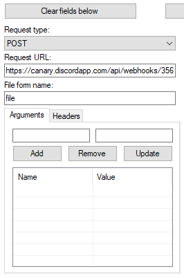
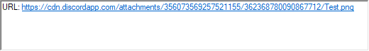
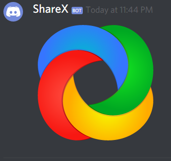

# Webhooks \(Part 3\)

In the last two chapters we covered how to create and use the webhook's via code.

In this chapter we will cover third party services such as [Zapier](https://zapier.com/), [IFTT](https://ifttt.com/) and even [ShareX](https://getsharex.com/). If you're a member of my guild you'll know it has a \#video-guides channel where a webhook posts my videos when I release them, that youtube-to-discord bridge is provided by Zapier \(More on that later\).

But before we jump to Zapier, let's cover something I should of covered in the first chapter.

The [official documentation](https://discordapp.com/developers/docs/intro) for the [webhook endpoints](https://discordapp.com/developers/docs/resources/webhook) for Discord list 3 "types", you have your [Standard Webhook](https://discordapp.com/developers/docs/resources/webhook#execute-webhook), you have a [Slack-Compatible Webhook](https://discordapp.com/developers/docs/resources/webhook#execute-slackcompatible-webhook) and a [Github-Compatible Webhook](https://discordapp.com/developers/docs/resources/webhook#execute-githubcompatible-webhook)

The standard webhook \(above\) basically acts like a normal message you would send with your bot, but you can set the avatar, username, etc, which means you don't need to set them when you create the webhook.

The slack-compatible webhook \(above\) is very fancy in comparison, they're basically `RichEmbeds` that you see a lot of moderation bots use, you can have thumbnails, images, and more \(see the [Slack Documentation](https://api.slack.com/incoming-webhooks) for more information\).

The github-compatible webhook \(above\) is like the slack-compatible webhook, but it's limited in it's customisability, you can only "customise" what information it sends from Github and you cannot style it.

Now we've established the types of webhook Discord can handle, we'll focus on the regular webhook, and the Slack-Compatible webhook.

Now there's not much we can do with third party services in regards to the standard webhook, but a friend of mine informed me, that you can use the discord webhook's with [ShareX](https://getsharex.com/).

## ShareX

Now, download and install [ShareX](https://getsharex.com/) and open up the program and click the drop down menu for `Destinations` and click [Destination Settings](https://raw.githubusercontent.com/AnIdiotsGuide/discordjs-bot-guide/master/.gitbook/assets/wh10.png) then scroll down to the bottom for [Custom Uploaders](https://raw.githubusercontent.com/AnIdiotsGuide/discordjs-bot-guide/master/.gitbook/assets/wh11.png) and click it.

In the text field just under "Uploaders" put in `Discord`.


Take note of the `Add`, `Remove` and `Update` buttons a little below that field, we'll be using those later.


That will be the name for this custom uploader. After that, make sure the `Request type` is set to `POST`, and where it says `Request URL`, that is where you want to put the webhook URL you got from your discord channel.

Under that text field is another with the label `File form name`, just put `file` in there.

We're almost finished! Now in the bottom right corner you will find a section with three fields, `URL`, `Thumbnail URL` and `Deletion URL`, the only one we want is the `URL` field.

Drop this in there. `$json:attachments[0].url$` and now let's save and test!

Just below the text box where you entered `Discord` for this custom uploader, hit the `Add` button and it will save the settings for you, now onto testing.

On the left side, there is a series of drop down menus, click the drop down for the `Image uploader` and select Discord and give that shiny `Test` button a click.

If everything went smoothly, you should have a response in the bottom right text box, it should look something like this;

And if we go to our channel and check it out we should see the following;

## Congratulations

You've successfully managed to use Discord to store your quick image snips, but we're not done yet, in the next chapter we'll cover [Zapier](https://zapier.com/) and [IFTTT](https://ifttt.com/) for more advanced usages.

