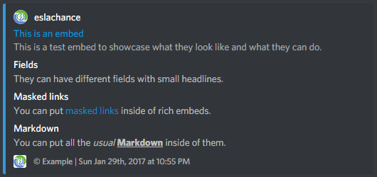

# Using Embeds in messages


Embeds might look nice but they can be disabled through permissions and user preferences, and will not look the same on mobile - especially complex ones. It's strongly recommended _not_ to use them unless you have a text-only fallback. Yes they're nice, but, don't use them if you don't _need_ to!


## Object-based embeds

Here are a few rules for embeds:

* Every field is optional
* At least one field must be present
* No field can be empty, null, or undefined.

Those aren't just guidelines, they are rules, and breaking those rules means your embed will not send - it will return `Bad Request`.

There are 2 ways to do embeds. The first, is by writing the embed yourself, as an object. Here's a very, _very_ basic embed that writes on a single line:

```javascript
message.channel.send({embed: {
  color: 3447003,
  description: "A very simple Embed!"
}});
```

The `color` determines the bar on the left \(here, a very nice blue\), and the `description` is the main contents of the message.

### Adding "Fields"

Fields are what can make embeds really nice - each field can have a title and value, and fields can also be stacked horizontally - as columns. Here's a more complex example of an embed that has many different fields, as well as icons and a footer:

```javascript
message.channel.send({embed: {
    color: 3447003,
    author: {
      name: client.user.username,
      icon_url: client.user.avatarURL
    },
    title: "This is an embed",
    url: "http://google.com",
    description: "This is a test embed to showcase what they look like and what they can do.",
    fields: [{
        name: "Fields",
        value: "They can have different fields with small headlines."
      },
      {
        name: "Masked links",
        value: "You can put [masked links](http://google.com) inside of rich embeds."
      },
      {
        name: "Markdown",
        value: "You can put all the *usual* **__Markdown__** inside of them."
      }
    ],
    timestamp: new Date(),
    footer: {
      icon_url: client.user.avatarURL,
      text: "© Example"
    }
  }
});
```

This results in the following:



## RichEmbed Builder

There is an alternative to using straight-up objects, which might be simpler in some cases - it's certainly cleaner! It's using the `RichEmbed` builder.

The same rules apply for `RichEmbed` as does normal ones. In fact, the builder is just a shortcut to get the same object and offers no more, no less functionality. Here is a similar example to the one above, using the `RichEmbed`. It also has a nice fancy image, to boot!

```javascript
const embed = new Discord.RichEmbed()
  .setTitle("This is your title, it can hold 256 characters")
  .setAuthor("Author Name", "https://i.imgur.com/lm8s41J.png")
  /*
   * Alternatively, use "#00AE86", [0, 174, 134] or an integer number.
   */
  .setColor(0x00AE86)
  .setDescription("This is the main body of text, it can hold 2048 characters.")
  .setFooter("This is the footer text, it can hold 2048 characters", "http://i.imgur.com/w1vhFSR.png")
  .setImage("http://i.imgur.com/yVpymuV.png")
  .setThumbnail("http://i.imgur.com/p2qNFag.png")
  /*
   * Takes a Date object, defaults to current date.
   */
  .setTimestamp()
  .setURL("https://discord.js.org/#/docs/main/indev/class/RichEmbed")
  .addField("This is a field title, it can hold 256 characters",
    "This is a field value, it can hold 1024 characters.")
  /*
   * Inline fields may not display as inline if the thumbnail and/or image is too big.
   */
  .addField("Inline Field", "They can also be inline.", true)
  /*
   * Blank field, useful to create some space.
   */
  .addBlankField(true)
  .addField("Inline Field 3", "You can have a maximum of 25 fields.", true);

  message.channel.send({embed});
```

Which produces the following:


How ever, if you want a quick and easy way of designing an embed, try out this new tool by `leovoel`, the [Embed Visualizer](https://leovoel.github.io/embed-visualizer/) shows you exactly how your embed will look, and will generate the code for you at the press of a button.

