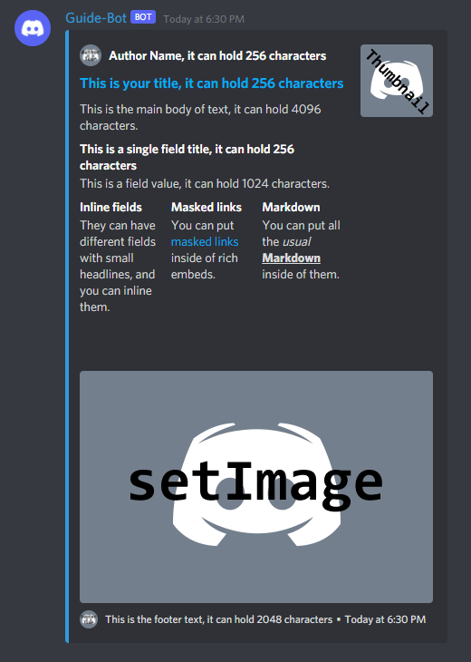

# Using Embeds in messages


Embeds might look nice but they can be disabled through permissions and user preferences, and will not look the same on mobile - especially complex ones. It's strongly recommended _not_ to use them unless you have a text-only fallback. Yes they're nice, but, don't use them if you don't _need_ to!


## Embeds

Here are a few rules for embeds:

* Every field is optional
* At least one field must be present
* No field can be empty, null, or undefined.

Those aren't just guidelines, they are rules, and breaking those rules means your embed will not send - it will return `Bad Request`.

There are 2 ways to do embeds. The cleanest way is by using the `MessageEmbed` builder and the second is writing the object itself, we'll cover the `MessageEmbed` builder _first._

## MessageEmbed Builder

The same rules apply for `MessageEmbed` as they do for object based ones. In fact, the builder is just a shortcut to get the same object and offers no more, no less functionality.

```javascript
const embed = new Discord.MessageEmbed()
  /*
   * Alternatively, use "#3498DB", [52, 152, 219] or an integer number.
   */
  .setColor(0x3498DB)
  .setAuthor("Author Name, it can hold 256 characters", "https://i.imgur.com/lm8s41J.png")
  .setTitle("This is your title, it can hold 256 characters")
  .setURL("https://discord.js.org/#/docs/main/stable/class/MessageEmbed")
  .setDescription("This is the main body of text, it can hold 4096 characters.")
  .setImage("http://i.imgur.com/yVpymuV.png")
  .setThumbnail("http://i.imgur.com/p2qNFag.png")
  .addField("This is a single field title, it can hold 256 characters", "This is a field value, it can hold 1024 characters.")
  /*
   * Inline fields may not display as inline if the thumbnail and/or image is too big.
   */
  .addFields(
    { name: "Inline fields", value: "They can have different fields with small headlines, and you can inline them.", inline: true },
    { name: "Masked links", value: "You can put [masked links](https://discord.js.org/#/docs/main/master/class/MessageEmbed) inside of rich embeds.", inline: true },
    { name: "Markdown", value: "You can put all the *usual* **__Markdown__** inside of them.", inline: true }
  )
  /*
   * Blank field, useful to create some space.
   */
  .addField("\u200b", "\u200b")
  /*
   * Takes a Date object, defaults to current date.
   */
  .setTimestamp()
  .setFooter("This is the footer text, it can hold 2048 characters", "http://i.imgur.com/w1vhFSR.png");
  /*
   * With Discord now allowing messages to contain up to 10 embeds, we need to put it in an array.
   */
  message.channel.send({ embeds: [embed] });
```

Which produces the following:



Now doesn't that code look clean and amazing? Well let's look at the object version.

```javascript
  message.channel.send({ embeds: [{
    color: 3447003,
    author: {
      name: "Author Name, it can hold 256 characters",
      icon_url: "https://i.imgur.com/lm8s41J.png"
    },
    thumbnail: {
      url: "http://i.imgur.com/p2qNFag.png"
    },
    image: {
      url: "http://i.imgur.com/yVpymuV.png"
    },
    title: "This is your title, it can hold 256 characters",
    url: "https://discord.js.org/#/docs/main/master/class/MessageEmbed",
    description: "This is the main body of text, it can hold 2048 characters.",
    fields: [{
      name: "This is a single field title, it can hold 256 characters",
      value: "This is a field value, it can hold 1024 characters.",
      inline: false
    },
    {
      name: "Inline fields",
      value: "They can have different fields with small headlines, and you can inline them.",
      inline: true
    },
    {
      name: "Masked links",
      value: "You can put [masked links](https://discord.js.org/#/docs/main/master/class/MessageEmbed) inside of rich embeds.",
      inline: true
    },
    {
      name: "Markdown",
      value: "You can put all the *usual* **__Markdown__** inside of them.",
      inline: true
    },
    {
      name: "\u200b",
      value:"\u200b"
    }],
    timestamp: new Date(),
    footer: {
      icon_url: "http://i.imgur.com/w1vhFSR.png",
      text: "This is the footer text, it can hold 2048 characters"
    }
  }]});
```

As you can see it's bit of a chonker in comparison, but they both output the same embed so there's no real reason to show it off, congratulations you know how to use embeds in normal messages now!

Not that it's any different if you're using a webhook, or an interaction response.
