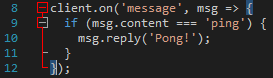

# Frequently Asked Questions

In this page, some very basic, frequently-asked questions are answered. It's important to understand that **these examples are generic** and will most likely not work if you just copy/paste them in your code. You need to **understand** these lines, not just blindly shove them in your code.

## Common Errors & Fixes

### Bad Request

#### Problem:

```
UnhandledPromiseRejectionWarning: Unhandled promise rejection (rejection id: 1): Error: Bad Request
```

#### Solution:

There can be 3 causes for this error:

* **Your message is empty**: An empty message, aka a 0-length string. Messages cannot be empty.
* **Your message is too big**: Any message over 2000 character is rejected, just like in the client
* **There is an error in your embed**: If you're attempting to send an embed, there is an error in it. For example an empty field, a field that's too large, etc.

#### Cannot find module `discord.js`

#### Problem:

You didn't install Discord.js or installed it in the wrong folder

#### Solution:

* Make sure you are in the **correct** folder where you have your bot's files
* SHIFT+Right-Click in the folder and select **Open command window here**
* Run `npm init` , and hit enter until the wizard is complete
* Run `npm i -S discord.js` again to install Discord.

### Unexpected End of Input

#### Problem:

```
});
  ^
SyntaxError: Unexpected end of input
```

#### Solution:

Your code has an error somewhere. This is _impossible_ to troubleshoot without the **complete** code, since the error can be anywhere \(in fact the error stack often tells you it's at the end of your code\).

The following trick is a lifesaver, so pay attention: Your code editor is trying to help you. Whatever editor you're using \(except notepad.exe. Don't use notepad!\), clicking on any \(and I mean any\) special character such as parentheses, square brackets, curly braces, double and single quotes, will automatically highlight the one that matches it. The screenshot below shows this: I clicked on the curly brace at the bottom, it shows me the one on top by highlighting it. Learn this, and how different functions and event handlers "look" like.



You can check out [Installing and Using a Proper Editor](/getting-started/installing_and_using_a_proper_editor.md) to help in at least knowing there are errors _before_ running your bot code.

## Code Examples

#### How the examples are built

Examples are built with the &lt;Classes&gt; defined within brackets. This means that when we show &lt;Client&gt; it means your client variable, such as `client` or `bot`. To get a better idea of what those are, refer to the documentation - in the menu on the left, every link is a class with the same name that is referred to here. You **must** replace these with the proper variables!

## Bot and Bot Client

```js
// Set the bot's "Playing: " status (must be in an event!)
<Client>.on("ready", () => {
    <Client>.user.setGame("with my code");
});
```

```js
// Set the bot's online/offline/dnd/invisible status
<Client>.on("ready", () => {
    <Client>.user.setStatus("online");
});
```

## Users and Members

```js
// Get a User by ID
<Client>.users.get("user id here");
// Returns <User>
```

```js
// Get a Member by ID
<Guild>.members.get("user ID here");
// Returns <Member>
```

```js
// Get a Member from message Mention
<Guild>.member(<Message>.mentions.users.first());
// Returns <Member>
```

```js
// Send a Direct Message to a user
<User>.send("hello");
```

```js
// Mention a user in a message
<Channel>.send(`Hello ${user}, and welcome!`);
// or
<Channel>.send("Hello " + <User>.toString() + ", and welcome!");
```

## Channels and Guilds

```js
// Get a Guild by ID
<Client>.guilds.get("the guild id");
// Returns <Guild>
```

```js
// Get a channel by ID
<Client>.channels.get("the channel id");
// Returns <Channel>
```

```js
// Get a Channel by Name (note: THIS IS NOT RECOMMENDED as more than one channel can have the same name!)
<Guild>.channels.find("name", "channel-name");
// returns <Channel>
```

```js
// Send a message to the guild's default channel (often `#general`)
<Guild>.defaultChannel.send("I'm bored so I'll spam you.");
```
