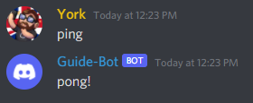

# Getting Started - Long Version

So, you want to write a bot and you know some JavaScript, or maybe even node.js. You want to do cool things like a music bot, tag commands, random image searches, the whole shebang. Well you're at the right place!


**This is the long version** with a whole lot of useless blabbering text, jokes and explanations.  
Here's the [TL;DR \(short\) version](getting-started-tl-dr.md)


This tutorial will get you through the first steps of creating a bot, configuring it, making it run, and adding a couple of commands to it.

## Step 1: Creating your App and Bot account

The first step in creating a bot is to create your own Discord _application_. The bot will use the Discord API, which requires the creation of an account for authentication purposes. Don't worry though, it's super simple.

### Creating the App account

To create the application, head to the [Discord application page](https://discord.com/developers/applications/). Assuming you're logged in \(if not, do so now\), you'll reach a page that looks like this:


Click on \(you guessed it!\) **New Application**. This brings up the following modal, in which you should simply enter a name for the _application_ \(this will be the initial bot username\). Click **Create** which will create the application itself.


The **Application ID** on the  page will be your bot's user ID. The application description is used in the bots `About me` section. So feel free to add a description of your bot in under 190 characters.

 Whilst the page clearly indicates a maximum of 400, only 190 will be displayed in the `About me` section.


### Create the bot account

After creating the application, we need to create the **Bot User**. Go to the **Bot** section on the left, and you will be greeted with the following screen.


Finally click on **Add Bot**, then **Yes, Do it** to create your bot.


There's a few things you can change here and most importantly the token.


* `Icon` to change the bot's avatar \(can also be done with discord.js\)
* `Username` to change your bot's username on Discord \(this can also be done through code\).
* `Token` This is your bot's token, which will be used when connecting to discord. See [the section below](getting-started-long-version.md#getting-your-bot-token) for details.
* `Public bot` This toggles the ability for other users to add your bot to their server. You can turn this off during development to prevent random users inviting it.
* `Require Oauth2 Code Grant` Don't check this. Just, don't. It's not useful to you and will cause problems if you turn it on.
* `Privileged Gateway Intents` Now this is important, if your bot is checking presence data, or downloading the member list, you will need to toggle either or both of these, for now they're not needed. But please note, if your bot reaches 100 servers you will need to be whitelisted and verified to use these.

### Add your bot to a server

Okay so, this might be a bit early to do this but it doesn't really matter - even if you haven't written a single line of code for your bot, you can already "invite" it to a server. In order to add a bot, you need _Manage Server_ or _Administrator_ permissions on that server. This is the **only** way to add a bot, it cannot use invite links or any other methods.

To generate the link, click on **OAuth2** in the app page (it's above `Bot`), and scroll down to **Scopes**. Check the `bot` scope to generate a link, if you're planning on adding slash commands make sure to click `applications.commands` as well.

Usually, bots are invited with the specific _permissions_ which are given to the bot's role which cannot be removed unless you kick and reinvite the bot. This is optional, but you can set those permissions in the **Bot** page, scrolling down to the **Bot Permissions** section. Check any permissions your bot requires. This modifies the invite link above, which you can then share.

Once you have the link, you can copy it to a browser window and visit it. When you do this, You get shown a window letting you choose the server where to add the bot, simply select the server and click **Authorize**.



You need to be logged in to Discord on the browser with your account to see a list of servers. You can only add a bot to servers where you have **Manage Server** or **Administrator** permissions.


### Getting your Bot Token


Alright so, **big flashy warning**, **PAY ATTENTION**. This next part is really, really important: Your bot's **token** is meant to be **SECRET**. It is the way by which your bot authenticates with the Discord server in the same way that you login to Discord with a username and password. **Revealing your token is like putting your password on the internet**, and anyone that gets this token can use **your** bot connection to do things. Like delete all the messages on your server and ban everyone. If your token ever reaches the internet, **change it immediately**. This includes putting it on pastebin/hastebin, having it in a public github repository, displaying a screenshot of it, anything. **GOT IT? GOOD!**, Github has partnered with Discord to invalidate your token if it's found within your code repository and message you via a `System` message on Discord.


With that warning out of the way, on to the next step. The Token, as I just mentioned, is the way in which the bot authenticates. To get it, go to the **Bot** section of the app page, then click **Copy** to copy it to the clipboard. You can also _view_ your token here if you wish. Not forgetting that ever important `Regenerate` key if your token is compromised:


## Step 2: Getting your coding environment ready

This might go beyond saying but I'll say it anyway: You can't just start shoving bot code in notepad.exe and expect it to work. In order to use discord.js you will need a couple of things installed. At the very least:

* Get Node.js version 16.6 or higher \(earlier versions are not supported\). [Download for windows](https://nodejs.org/en/download/) or if you're on a linux distro, via [package manager](https://nodejs.org/en/download/package-manager/).
* Get an actual code editor. Don't use notepad or notepad++, they are not sufficient. [VS Code](https://www.visualstudio.com/en-us/products/code-vs.aspx) , [Sublime Text 3](https://www.sublimetext.com/3) and [Atom](https://atom.io/) are often recommended.

Once you have the required software, the next step is to prepare a _space_ for your code. Please don't just put your files on your desktop it's... unsanitary. If you have more than one hard drive or partition, you could create a special place for your development project. Mine, for example, is `D:\develop\` , and my bot is `D:\develop\guide-bot\` . Once you've created a folder, open your CLI \(command line interface\) in that folder. Linux users, you know how. Windows users, here's a trick: `SHIFT + Right Click` in the folder, then choose the "secret" command **Open PowerShell window here**. Magic!

And now ready for the next step!

## Installing Discord.js

So you have your CLI ready to go, in an empty folder, and you just wanna start coding. Alright, hold on one last second: let's install discord.js. But first we'll initialize this folder with NPM, which will ensure that any installed module will be here, and nowhere else. Simply run `npm init -y` and then hit Enter. A new file is created called `package.json`, [click here](https://docs.npmjs.com/files/package.json) for more info about it.

And now we install Discord.js through NPM, the Node Package Manager:

`npm i discord.js` _At the time of writing this v13 hasn't been released yet._


This will take a couple of heartbeats and display a lot of things on screen. Unless you have a big fat red message saying it didn't work, or package not found, or whatever, you're good to go. If you look at your folder, you'll notice that there's a new folder created here: `node_modules` . This contains all the installed packages for your project.

## Getting your first bot running


I honestly consider that if you don't understand the code you're about to see, coding a bot might not be for you. If you do not understand the following sample, please go to [CodeAcademy](https://www.codecademy.com/learn/javascript) and learn Javascript first. I beg of you: stop, drop, and roll.


Okay finally, we're ready to start coding. \o/ Let's take a look at the most basic of examples, the ping-pong bot. Here's the code in its entirety:

```javascript
const { Client, Intents } = require("discord.js");
// The Client and Intents are destructured from discord.js, since it exports an object by default. Read up on destructuring here https://developer.mozilla.org/en-US/docs/Web/JavaScript/Reference/Operators/Destructuring_assignment
const client = new Client({
  intents: [Intents.FLAGS.GUILDS, Intents.FLAGS.GUILD_MESSAGES]
});

client.on("ready", () => {
  console.log("I am ready!");
});

client.on("messageCreate", (message) => {
  if (message.content.startsWith("ping")) {
    message.channel.send("pong!");
  }
});

client.login("SuperSecretBotTokenHere");
```


The variable `client` here is used an an example to represent the [&lt;Client&gt;](https://discord.js.org/#/docs/main/stable/class/Client) class. Some people call it `bot`, but you can technically call it whatever you want. I recommend sticking to `client` though!


Okay let's just... actually get this guy to work, because this is literally **a functional bot**. So let's make it run!

1. Copy that code and paste it in your editor.
2. Replace the string in the `client.login()` function with _your_ token
3. Save the file as `index.js`.
4. In the CLI \(which should still be in your project folder\) type the following command: `node index.js`

If all went well \(hopefully it did\) your bot is now connected to your server, it's in your user list, and ready to answer all your commands... Well, at least, _one_ command: `ping`. In its current state, the bot will reply "pong!" to any message that starts with, _exactly_, `ping`. Let's demonstrate!



Success! You now have a bot running! As you probably realize by now I could probably blabber on from here, showing you a bunch of stuff. But the scope of this tutorial is completed, so I'll shut up now! Ciao!

## The Next Step?

Now that you have a basic, functional bot, it's time to start adding new features! Head on over to [Your First Bot](../first-bot/your-first-bot.md) to continue on your journey with adding new commands and features!

## Addendum: Getting help and Support

Before you start getting support from Discord servers to help you with your bot, I strongly advise taking a look at the following, very useful, resources.

* [Discord.js Documentation](http://discord.js.org) : For the love of all that is \(un\)holy, **read the documentation**. Yes, it will be alien at first if you are not used to "developer documentation" but it contains a whole lot of information about each and every feature of the API. Combine this with the examples above to see the API in context.
* [An Idiot's Guide](https://www.youtube.com/c/AnIdiotsGuide) is another great channel with more material. York's guides are great, and he continues to update them.
* [Evie.Codes on YouTube](https://www.youtube.com/channel/UCvQubaJPD0D-PSokbd5DAiw): If you prefer video to words, Evie's YouTube series \(which is good, though no longer maintained with new videos!\) gets you started with bots.
* [An Idiot's Guide Official Server](https://discord.gg/vXVxsAjSMF): The official server for An Idiot's Guide. Full of friendly helpful users!
* [Discord.js Official Server](https://discord.gg/djs): The official server has a number of competent people to help you, and the development team is there too!
