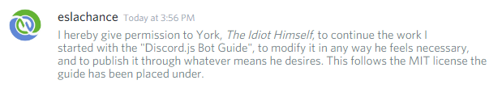

# Welcome

## Introduction

This guidebook was originally authored by eslachance\#4611 then handed down to me for future updates, but when she started the book originally it was because the examples for discord.js and the documentation were quite daunting for newcomers. There was definitely a space for this kind of document online, made obvious by the recurring questions that pop up almost every day on the support channels.

Seeing as though there needed to be some more detailed explanations as well as code samples, She figured a guide would be a great place to start!

To keep with the style of the official documentation, we will be using full terms \(client and message\) for those variables.

## Updating of this guide

I want to take a moment to thank Evie for everything she's done for the community. Now a lot of people's personal opinions will differ from mine, due to various levels of information that's out there.

But to me Evie is a mentor, she was the one that metaphorically took me under her wing and encouraged me to learn new things and to challenge myself, and hey I've got a decently popular YouTube series because of her, she played a major role in my decision to create a series, so please take a moment and think about how many people Evie has helped with this guide.

And I am honoured to be continuing it.

## Get Support

If you have any questions after reading this guide please join us on the official Discord.js server:

Last Updated: `21/01/2018`